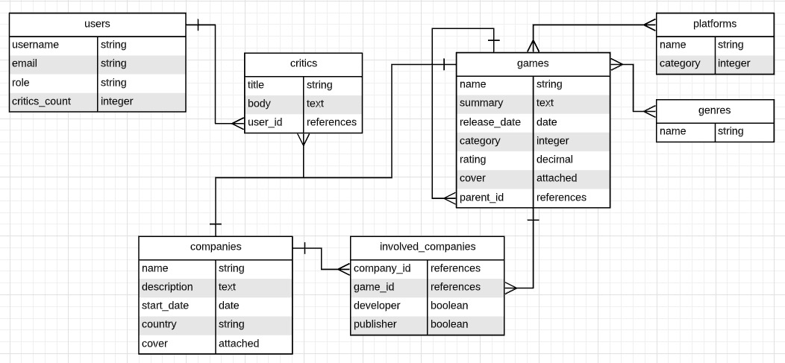

# Associaciones ( Active record )



# Creación de modelos

```bash
rails generate model User username email role critics_count:integer
```

```bash
rails generate model Critic title body_text user:references
```

<!-- `````` -->

```bash
rails generate model Company name description:text start_date:date country cover
```

```bash
rails generate model Game name summary:text realease_date:date category:integer rating:decimal cover
```

```bash
rails generate model Platform name category:integer
```

```bash
rails generate Genre name
```

```
rails generate model InvolvedCompany company:references game:references developer:boolean publisher:boolean
```

## Asociaciones Básicas
